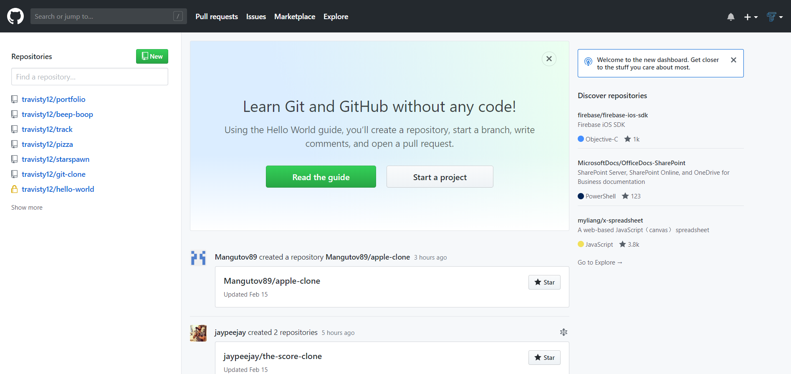
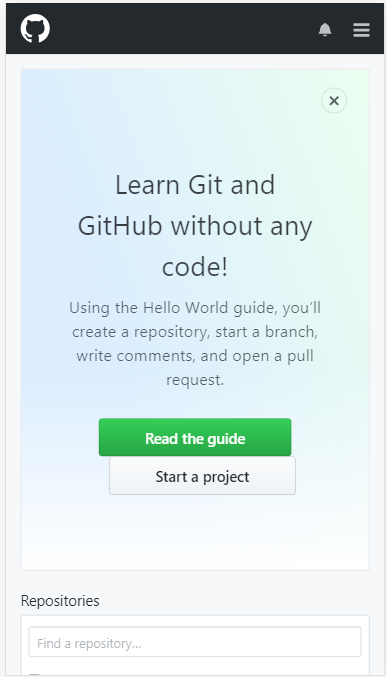
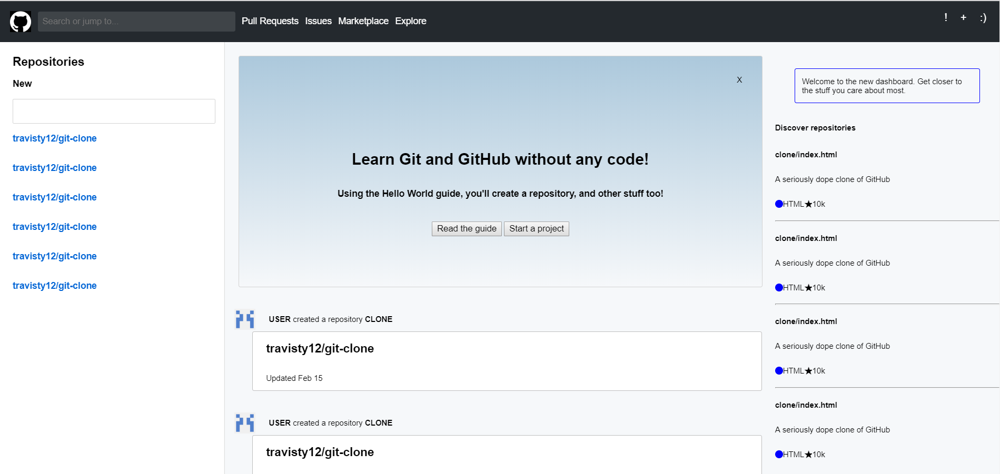
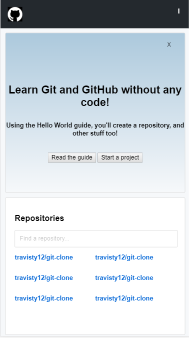

# _GitHub Clone_

#### _Exercise in using flexboxes to clone a site_

#### By _**Travis Toal**_

## Description

#### _Attempt at recreating GitHub's main page_

* _The site mimics GitHub's aesthetic and responsiveness_

* _Original dekstop view:_

* _Original mobile view:_

* _Cloned desktop view:_

* _Cloned mobile view:_

## Setup/Installation Requirements

* _SMASH that follow button at https://www.github.com/travisty12_
* _View a live site at https://travisty12.github.io/git-clone/_
* _Or, clone this repository to alter code and view the result in your browser_
* _To view changes to scss file, run "> sass --watch scss/input.scss:css/output.css" in the command line_

## Known Bugs

_None, please contact me if you find any!_

## Support and contact details

_Contact the author at travisty12@gmail.com_

## Technologies Used

_jQuery (and JavaScript)_

### License

*This software is licensed under the GPL License*

Copyright (c) 2019 **_Travis Toal_**
